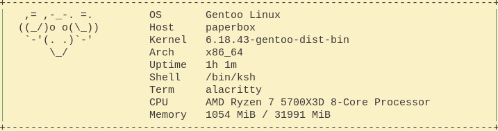

# plainfetch
A simple GNU/Linux fetch script written in POSIX sh.
Plainfetch is meant to be an easy to use alternative to larger fetch scripts.

## Picture

## License 
Plainfetch is licensed under MIT.

The logo in the file "logo" is licensed under the following terms:
Copyright © 2004 Martin Dickopp

Permission is given to copy or distribute (or both) the above ASCII image, with or without modifications.
